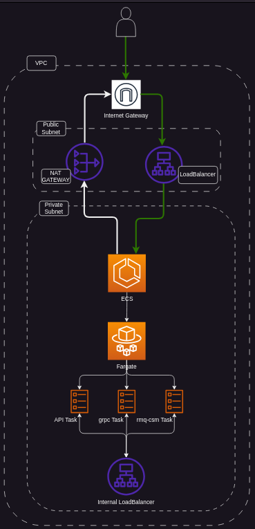

# AWS ECS Fargate with Golang CDKTF Project

## Table of Contents
- [Introduction](#introduction)
- [Cloud Infrastructure Automation](#cloud-infrastructure-automation)
- [What Terraform is?](#what-terraform-is)
- [What CDK for Terraform (CDKTF) is?](#what-cdk-for-terraform-cdktf-is)
- [What AWS ECS Fargate is?](#what-aws-ecs-fargate-is)
- [Pre-requirements](#pre-requirements)
- [Project infrastructure]()
- [Execution Guide](#execution-guide)
- [License](#license)

## Introduction

This project demonstrates the implementation of a highly scalable and efficient cloud infrastructure using AWS ECS Fargate and Cloud Development Kit for Terraform (CDKTF) with Golang. The goal is to showcase how containerized applications can be deployed and managed effectively in the cloud.

## Cloud Infrastructure Automation

### The Need for Automation
Automating cloud infrastructure is crucial for efficient resource management, cost reduction, and eliminating human errors in cloud configurations.

### Common Tools
Several tools are popular in the community for cloud automation, including:
- Terraform
- AWS CloudFormation
- Ansible
- Chef
- Puppet

## What Terraform is?

Terraform by HashiCorp is an Infrastructure as Code (IaC) tool used for building, changing, and versioning infrastructure safely and efficiently. 

### Advantages of Terraform
- **Platform Agnostic**: Works with various cloud providers.
- **State Management**: Tracks state of infrastructure.
- **Modularity**: Reusable components for various infrastructures.

## What CDK for Terraform (CDKTF) is?

CDKTF combines the power of programming languages with Terraform's infrastructure management capabilities.

### How CDKTF Works
- Allows defining cloud infrastructure using familiar programming languages.
- Generates Terraform configuration files from code.
- Offers the flexibility of Terraform with the abstraction of programming languages.

## What AWS ECS Fargate is?

AWS ECS Fargate is a serverless compute engine for containers that removes the need to manage servers or clusters.

### Features and Advantages
- **Serverless**: No need to manage servers or clusters.
- **Scalability**: Automatically scales up or down based on demand.
- **Security**: Runs each task or service in its own isolated environment.

### Components
- **Task Definitions**: Defines the containers and volumes for your application.
- **Services**: Maintains the desired number of tasks and handles task replacement.

## Pre-requirements

To use this project, you need:
- Terraform (latest version)
- CDKTF (latest version)
- Golang (latest version)
- Run `cdktf get` inside the CDKTF folder.

## Project Infrastructure

## Execution Guide

1. **Set up AWS Credentials**: Ensure your AWS credentials are configured.
2. **Initialize the Project**: Run `cdktf init` in the project directory.
3. **Deploy the Infrastructure**: Execute `cdktf deploy` to build and deploy the ECS Fargate infrastructure.
4. **Verify Deployment**: Check the AWS console to confirm the deployment.

Feel free to explore, modify, and use this project as a foundation for your containerized applications on AWS ECS Fargate using CDKTF with Golang!

## License
This project is licensed under the MIT License. For more details, see the [LICENSE](./LICENSE) file in the repository.
